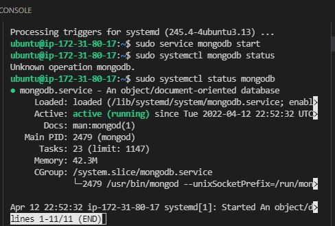
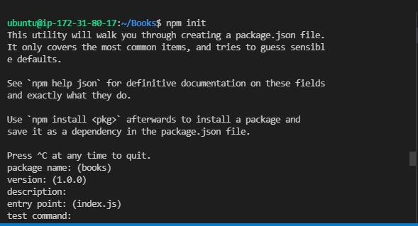
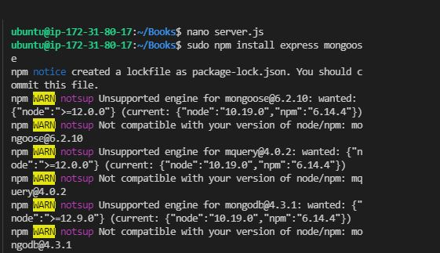
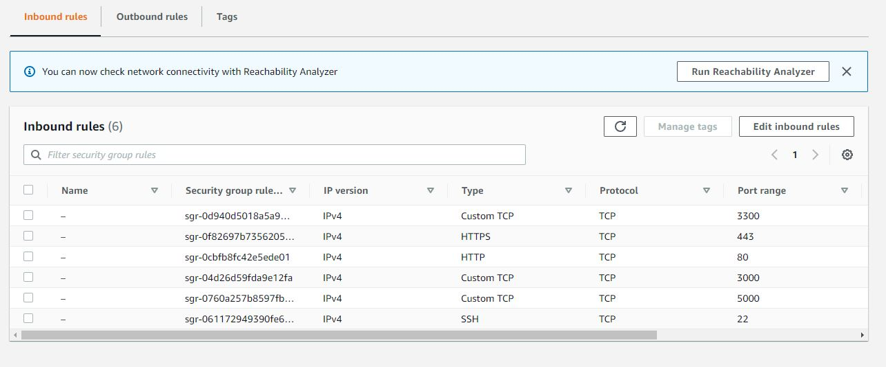
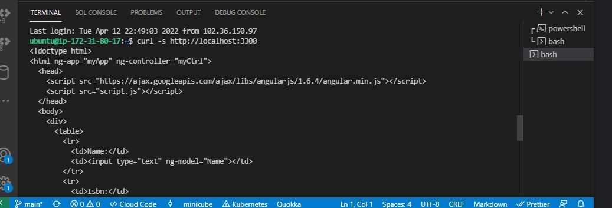
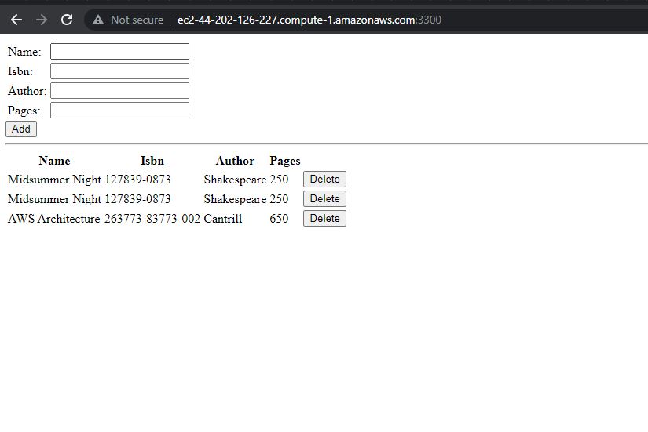

# Documentation for Project 4 - MEAN-STACK on AWS
- Step 1 -- Setup Servers on AWS 
  
   - `sudo apt-get update && sudo apt-get upgrade` 
   - ``` sudo apt -y install curl dirmngr apt-transport-https lsb-release ca-certificates
         curl -sL https://deb.nodesource.com/setup_12.x | sudo -E bash -

         sudo apt install -y nodejs

         sudo apt-key adv --keyserver hkp://keyserver.ubuntu.com:80 --recv 0C49F3730359A14518585931BC711F9BA15703C6

         echo "deb [ arch=amd64 ] https://repo.mongodb.org/apt/ubuntu trusty/mongodb-org/3.4 multiverse" | sudo tee /etc/apt/sources.list.d/mongodb-org-3.4.list
         sudo apt install -y mongodb

         sudo service mongodb start
         sudo systemctl status mongodb
     ```

   -  
  
### Get the Node.js software and set it up 
   - `sudo apt install -y npm`
   - `sudo npm install body-parser`

### Create a directory for our application
### Switch into the directory above and initialise npm
   - `mkdir Books && cd Books&& npm init`
   - 

### Next we install ExpressJS and create a file index.js, note we are still working in the directory To-do 
   - `npm install express && touch server.js`
   - 
### Copy the code below into server.js 

    ```
        var express = require('express');
        var bodyParser = require('body-parser');
        var app = express();
        app.use(express.static(__dirname + '/public'));
        app.use(bodyParser.json());
        require('./apps/routes')(app);
        app.set('port', 3300);
        app.listen(app.get('port'), function() {
        console.log('Server up: http://localhost:' + app.get('port'));
        });
    ```
### Start server and verify it works, we also need to edit our security group and open port 5000 for Custom TCP

    `node index.js`

### Fetch server IP Address and DNS name
    `curl -s http://169.254.169.254/latest/meta-data/public-ipv4 `

    `http://169.254.169.254/latest/meta-data/public-hostname`

### SetupSever and configure Security Groups
   - `node server.js`
   - 
   - 
   -   
